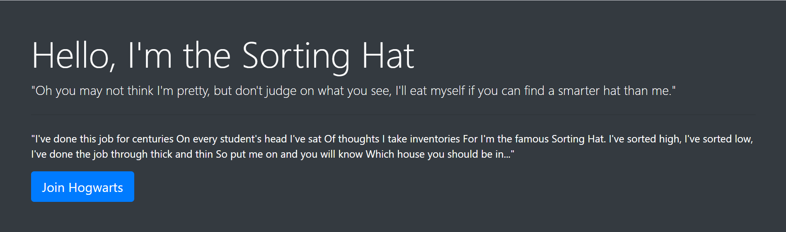
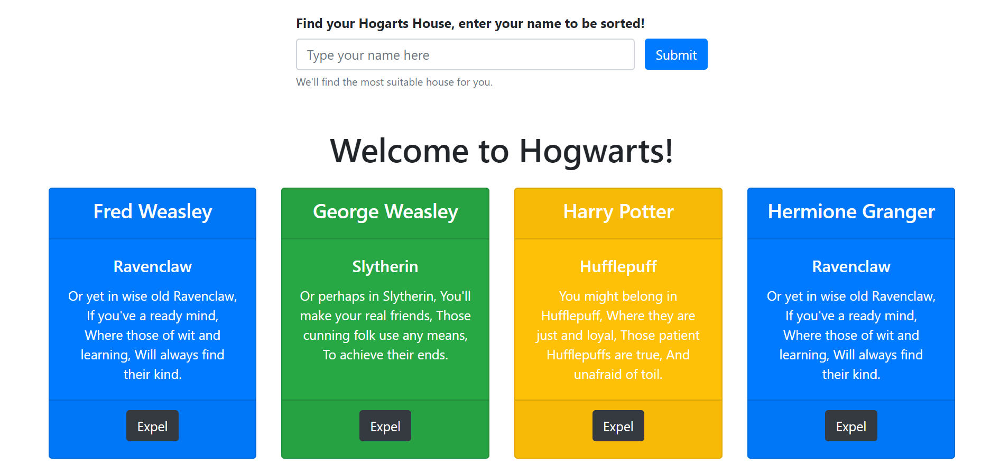
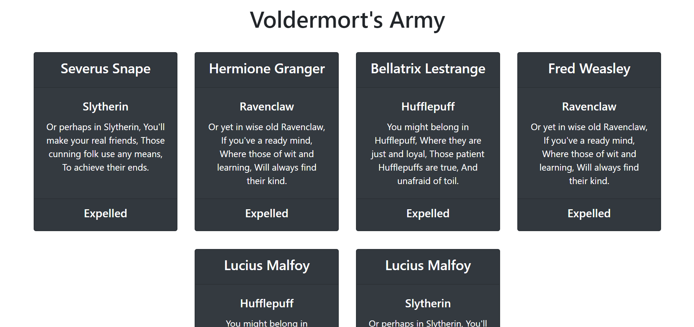

# sorting-hat

## Description 
This project is an exploration into the bootstrap grid system, buttons, and form control. I used bootstrap jumbotron to display a header introduction to the site. In the jumbotron after the introduction there is a button to join Hogwarts via Sorting Hat. When this button is clicked a bootstrap form and button print to page under the jumbotron. I gave the users the ability to type in thier name in the form and click the button to join. When the button next to the form is clicked, the users name is sent to a sorting function that assigns them to a random house which then prints a card of the user name with house and song. With in the card there is an expel button when clicked adds the user "student" to Voldermort's Army a new `div` under the new student cards. These were created by using event listeners and functions that controled print to DOM. 

## Screenshots

## How to Run
1. Clone down this repo
2. Make sure you have http-server installed via npm. If not get it
[HERE](https://www.npmjs.com/package/http-server)
3. On your command line run `hs -p 8080`
4. In your browser go to `https://localhost:8080`
